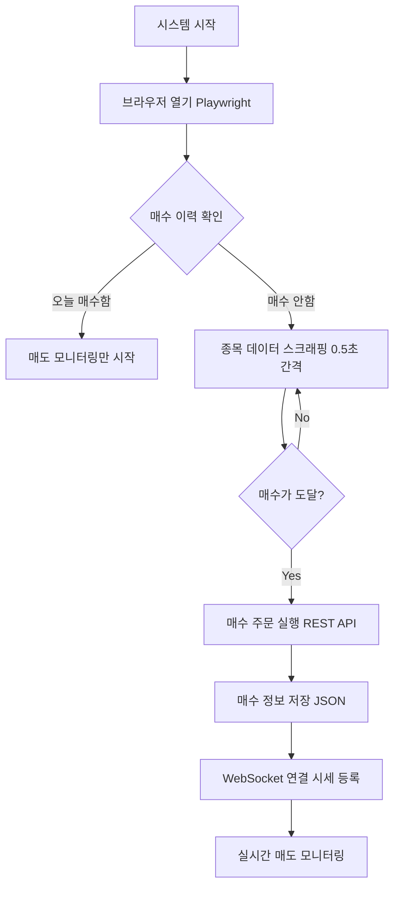
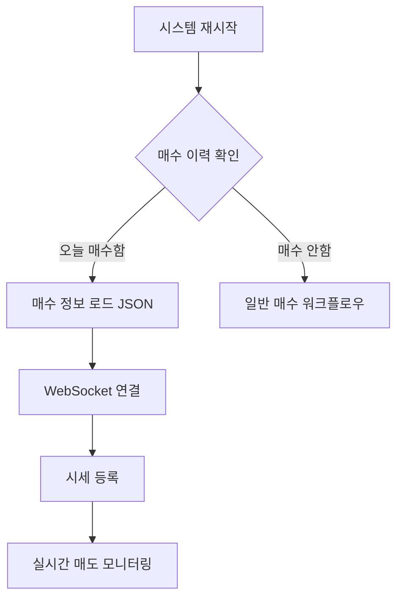
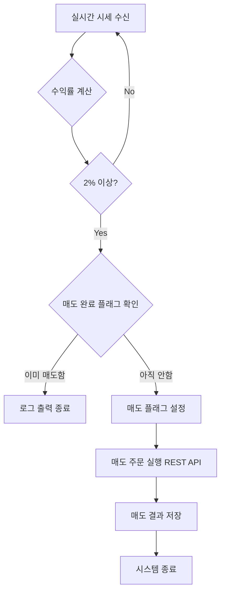

# 키움증권 자동매매 시스템 PRD

## 프로젝트 개요

키움증권 OpenAPI를 활용한 국내 주식 자동매매 시스템. Playwright를 이용한 웹 스크래핑으로 매수 종목을 선정하고, REST API로 주문 실행, WebSocket으로 실시간 시세를 모니터링하여 자동 매도를 수행합니다.

### 핵심 기능
- 🔍 장 시작 후 실시간 종목 스크래핑 (09:00~09:10)
- 📊 매수 조건 충족 시 자동 주문 실행
- 💰 실시간 시세 모니터링 및 목표 수익률 도달 시 자동 매도
- 🔄 WebSocket 연결 유지 및 자동 재연결
- 🛡️ 일일 1회 매수 제한 및 중복 매도 방지

---

## 기술 스택

### 언어 및 환경
- **Python**: >=3.10
- **패키지 관리자**: UV (uv)
- **플랫폼**: Windows (WSL2)

### 주요 라이브러리
- **Playwright**: 브라우저 자동화 및 웹 스크래핑
- **websockets**: 실시간 시세 수신
- **requests**: REST API 통신
- **python-dotenv**: 환경 변수 관리
- **asyncio**: 비동기 처리

### API
- **키움증권 REST OpenAPI**: OAuth2 인증, 주문 실행
- **키움증권 WebSocket API**: 실시간 시세 수신

---

## 시스템 아키텍처

### 파일 구조

```
stock/
├── auto_trading.py              # 메인 자동매매 시스템
├── kiwoom_order.py              # REST API 주문 처리
├── kiwoom_websocket.py          # WebSocket 실시간 시세
├── daily_trading_lock.json      # 일일 매수 이력 추적
├── trading_results/             # 매수/매도 결과 기록
├── .env                         # 환경 변수 설정
├── .gitignore                   # Git 제외 파일
├── pyproject.toml               # 프로젝트 의존성
└── PRD.md                       # 프로젝트 문서 (본 문서)
```

### 주요 컴포넌트

#### 1. AutoTradingSystem (`auto_trading.py`)
**역할**: 전체 자동매매 프로세스 오케스트레이션

**주요 메서드**:
- `start_auto_trading()`: 매매 시스템 시작 (브라우저 + WebSocket)
- `start_sell_monitoring()`: 매도 전용 모니터링 (WebSocket only)
- `check_stock_data()`: Playwright로 종목 데이터 스크래핑
- `execute_auto_buy()`: 매수 조건 충족 시 자동 주문
- `execute_auto_sell()`: 목표 수익률 도달 시 자동 매도
- `on_price_update()`: 실시간 시세 콜백 처리

**주요 로직**:
```python
# 매수 조건 체크
if stock_data and stock_data.get("hasData"):
    current_price = stock_data["현재가"]
    target_price = stock_data["매수가"]

    if current_price >= target_price:
        # 일일 1회 매수 제한 체크
        if not self.check_today_trading_done():
            await self.execute_auto_buy(stock_data)

# 매도 조건 체크 (실시간 콜백)
profit_rate = (current_price - buy_price) / buy_price
if profit_rate >= 0.02:  # 2% 수익률
    await self.execute_auto_sell()
```

#### 2. KiwoomOrderAPI (`kiwoom_order.py`)
**역할**: REST API를 통한 주문 실행 및 인증

**주요 메서드**:
- `get_access_token()`: OAuth2 Access Token 발급
- `place_order()`: 주식 주문 실행 (매수/매도)
- `place_market_buy()`: 시장가 매수 주문
- `place_market_sell()`: 시장가 매도 주문

**API 엔드포인트**:
- 토큰 발급: `POST /oauth2/token`
- 주문 실행: `POST /uapi/domestic-stock/v1/trading/order-cash`

**틱 단위 처리**:
```python
def calculate_tick_price(price: int, direction: str = "up") -> int:
    """한국 주식시장 틱 단위 계산"""
    if price < 1000: return 1
    elif price < 5000: return 5
    elif price < 10000: return 10
    # ... 가격대별 틱 단위
```

#### 3. KiwoomWebSocket (`kiwoom_websocket.py`)
**역할**: 실시간 시세 수신 및 연결 유지

**주요 메서드**:
- `connect()`: WebSocket 연결 및 로그인
- `register_stock()`: 실시간 시세 등록 (TR: 0A - 주식기세)
- `receive_loop()`: 데이터 수신 루프 + 자동 재연결
- `_handle_realtime_data()`: 실시간 데이터 파싱 및 콜백 호출

**PING/PONG 처리** (연결 유지 핵심):
```python
if data.get("trnm") == "PING":
    # 서버 heartbeat에 응답하여 연결 유지
    await self.websocket.send(message)
    logger.debug("💓 PING 응답 전송 (연결 유지)")
```

**자동 재연결 로직**:
```python
# 연결 끊김 감지 시
if not self.is_connected:
    logger.info("🔄 2초 후 WebSocket 재연결을 시도합니다...")
    await asyncio.sleep(2)

    # 기존 콜백 백업 및 재연결
    saved_callbacks = self.callbacks.copy()
    await self.connect()

    # 모든 종목 재등록
    for stock_code, callback in saved_callbacks.items():
        await self.register_stock(stock_code, callback)
```

---

## 핵심 워크플로우

### 1. 신규 매수 시나리오 (09:00~09:10)



**타임라인**:
- `09:00:00` - 시스템 시작, 브라우저 오픈
- `09:00:00~09:10:00` - 0.5초 간격으로 종목 데이터 체크
- `09:0X:XX` - 매수가 도달, 즉시 매수 주문
- `09:0X:XX~` - WebSocket 실시간 시세 모니터링 시작

### 2. 재시작 시나리오 (매수 완료 후)



**특징**:
- 브라우저 없이 WebSocket만 사용
- 매수 정보 복원: 종목코드, 매수가, 수량
- 즉시 매도 모니터링 시작

### 3. 매도 시나리오



**수익률 계산**:
```python
profit_rate = (current_price - buy_price) / buy_price
target = 0.02  # 2%
```

---

## 환경 변수 설정

### `.env` 파일

```bash
# 모의투자 설정 (true: 모의투자, false: 실전투자)
USE_MOCK=false

# 실전투자 API KEY
KIWOOM_APP_KEY=your_real_app_key
KIWOOM_SECRET_KEY=your_real_secret_key

# 모의투자 API KEY
KIWOOM_MOCK_APP_KEY=your_mock_app_key
KIWOOM_MOCK_SECRET_KEY=your_mock_secret_key

# 자동매매 설정
ACCOUNT_NO=12345678-01
MAX_INVESTMENT=100000  # 최대 투자금액 (원)
```

### 환경별 설정

| 환경 | BASE_URL | WebSocket URL | 특징 |
|------|----------|---------------|------|
| 실전투자 | `https://api.kiwoom.com` | `wss://api.kiwoom.com:10000` | 실제 거래 |
| 모의투자 | `https://mockapi.kiwoom.com` | `wss://mockapi.kiwoom.com:10000` | KRX만 지원 |

---

## 데이터 구조

### 1. daily_trading_lock.json (일일 매수 이력)

```json
{
  "last_trading_date": "20251017",
  "trading_time": "2025-10-17 09:01:20",
  "stock_code": "051780",
  "stock_name": "큐로홀딩스",
  "buy_price": 1625,
  "quantity": 1230
}
```

**용도**:
- 일일 1회 매수 제한 체크
- 시스템 재시작 시 매수 정보 복원
- 매도 모니터링 재개

### 2. trading_results/ (매매 결과 기록)

**파일명 규칙**:
- 매수: `{timestamp}_{종목명}_매수결과.json`
- 매도: `{timestamp}_{종목명}_매도결과.json`

**매수 결과 예시**:
```json
{
  "timestamp": "20251017_090120",
  "action": "BUY",
  "stock_info": {
    "종목명": "큐로홀딩스",
    "종목코드": "051780",
    "현재가": "1,625원",
    "매수가": "1,617원",
    "목표가": "1,670원"
  },
  "order_result": {
    "success": true,
    "order_no": "0006570",
    "quantity": 1230,
    "order_type": "시장가"
  }
}
```

---

## API 명세

### REST API

#### 1. Access Token 발급
```http
POST /oauth2/token
Content-Type: application/json

{
  "grant_type": "client_credentials",
  "appkey": "{APP_KEY}",
  "secretkey": "{SECRET_KEY}"
}
```

**응답**:
```json
{
  "access_token": "eyJhbGc...",
  "token_type": "Bearer",
  "expires_in": 86400,
  "access_token_token_expired": "2025-10-18 09:01:20"
}
```

#### 2. 주식 주문
```http
POST /uapi/domestic-stock/v1/trading/order-cash
Content-Type: application/json
authorization: Bearer {access_token}
appkey: {APP_KEY}
appsecret: {SECRET_KEY}
tr_id: TTTC0802U (모의투자 매수)
       VTTC0802U (실전투자 매수)

{
  "CANO": "12345678",
  "ACNT_PRDT_CD": "01",
  "PDNO": "051780",
  "ORD_DVSN": "01",  // 01: 시장가
  "ORD_QTY": "1230",
  "ORD_UNPR": "0"
}
```

### WebSocket API

#### 1. 로그인
```json
{
  "trnm": "LOGIN",
  "token": "{access_token}"
}
```

**응답**:
```json
{
  "trnm": "LOGIN",
  "return_code": 0,
  "return_msg": "",
  "sor_yn": "Y"
}
```

#### 2. 실시간 시세 등록 (0A: 주식기세)
```json
{
  "trnm": "REG",
  "grp_no": "0001",
  "refresh": "1",
  "data": [{
    "item": ["051780"],
    "type": ["0A"]
  }]
}
```

**실시간 데이터 수신**:
```json
{
  "trnm": "REAL",
  "data": [{
    "type": "0A",
    "item": "051780",
    "values": [{
      "10": "1625",      // 현재가
      "11": "+35",       // 전일대비
      "12": "+2.20",     // 등락률
      "13": "100000"     // 거래량
    }]
  }]
}
```

#### 3. PING/PONG (연결 유지)
**서버 → 클라이언트**:
```json
{
  "trnm": "PING"
}
```

**클라이언트 → 서버** (즉시 응답):
```json
{
  "trnm": "PING"
}
```

**중요**: PING에 응답하지 않으면 약 40초 후 연결 종료

---

## 주요 알고리즘

### 1. 주문 수량 계산

```python
def calculate_order_quantity(
    current_price: int,
    max_investment: int
) -> int:
    """
    최대 투자금액 내에서 매수 가능한 수량 계산

    Args:
        current_price: 현재가 (원)
        max_investment: 최대 투자금액 (원)

    Returns:
        매수 수량 (주)
    """
    quantity = max_investment // current_price
    return quantity
```

### 2. 매수가 도달 확인

```python
def check_buy_condition(
    current_price: int,
    target_price: int
) -> bool:
    """
    매수 조건 체크

    Args:
        current_price: 현재가
        target_price: 매수가 (목표가)

    Returns:
        매수 여부
    """
    return current_price >= target_price
```

### 3. 수익률 계산

```python
def calculate_profit_rate(
    current_price: int,
    buy_price: int
) -> float:
    """
    수익률 계산

    Args:
        current_price: 현재가
        buy_price: 매수가

    Returns:
        수익률 (0.02 = 2%)
    """
    return (current_price - buy_price) / buy_price
```

### 4. 일일 매수 이력 체크

```python
def check_today_trading_done(self) -> bool:
    """
    오늘 이미 매수했는지 확인

    Returns:
        True: 오늘 매수함, False: 아직 안함
    """
    if not self.trading_lock_file.exists():
        return False

    with open(self.trading_lock_file, 'r') as f:
        lock_data = json.load(f)

    last_date = lock_data.get("last_trading_date")
    today = datetime.now().strftime("%Y%m%d")

    return last_date == today
```

---

## 에러 처리 및 안전장치

### 1. 중복 주문 방지

#### 매수 중복 방지
```python
# daily_trading_lock.json으로 일일 1회 제한
if self.check_today_trading_done():
    logger.info("🚫 오늘 이미 매수를 실행했습니다.")
    return
```

#### 매도 중복 방지
```python
# 이중 플래그 시스템
if self.sell_executed:
    logger.warning("⚠️ 이미 매도 주문을 실행했습니다.")
    return

self.sell_executed = True  # 즉시 플래그 설정
# ... 매도 주문 실행
```

### 2. WebSocket 연결 안정성

#### PING 응답 처리
```python
if data.get("trnm") == "PING":
    await self.websocket.send(message)
    logger.debug("💓 PING 응답 전송 (연결 유지)")
    continue
```

#### 자동 재연결
```python
while True:  # 무한 재연결 루프
    try:
        while self.is_connected:
            # 메시지 수신 및 처리
            pass
    except ConnectionClosed:
        # 2초 후 재연결 시도
        await asyncio.sleep(2)
        await self.connect()
        # 모든 종목 재등록
```

### 3. 브라우저 안정성

#### 페이지 종료 체크
```python
async def check_stock_data(self):
    if self.page.is_closed():
        logger.warning("⚠️ 브라우저 페이지가 닫혔습니다.")
        return None

    # 데이터 스크래핑
```

### 4. 로그 스팸 방지

```python
# 타임스탬프 기반 로그 쓰로틀링
last_log_time = None
LOG_INTERVAL = 10  # 10초

now = datetime.now()
if last_log_time is None or (now - last_log_time).seconds >= LOG_INTERVAL:
    logger.info("⏳ 종목 대기 중...")
    last_log_time = now
```

---

## 모니터링 및 로깅

### 로그 레벨

- `INFO`: 정상 동작 (연결, 주문, 시세 등록)
- `WARNING`: 주의 필요 (재연결, 브라우저 종료)
- `ERROR`: 오류 발생 (연결 실패, 주문 실패)
- `DEBUG`: 디버깅 정보 (PING, 메시지 수신)

### 주요 로그 메시지

```
✅ WebSocket 연결 성공!
📊 실시간 시세 등록: 051780
💓 PING 응답 전송 (연결 유지)
🔄 2초 후 WebSocket 재연결을 시도합니다...
📈 [051780] 현재가: 1,625원 | 수익률: 0.00%
💰 목표 수익률 2% 도달! 매도 주문을 실행합니다.
✅ 매도 주문 완료: 주문번호 0006571
```

---

## 성능 및 제약사항

### 성능 지표

| 항목 | 값 |
|------|-----|
| 웹 스크래핑 주기 | 0.5초 |
| WebSocket 연결 유지 | 무제한 (PING 응답) |
| 재연결 대기 시간 | 2초 |
| API 응답 시간 | ~100ms |
| 주문 실행 시간 | ~200ms |

### 제약사항

#### 1. 시간 제약
- **매수 모니터링**: 09:00~09:10 (10분간)
- **매도 모니터링**: 무제한 (2% 도달 시까지)
- **장 운영 시간**: 09:00~15:30

#### 2. 투자 제약
- **일일 매수 횟수**: 1회
- **매수 수량**: `MAX_INVESTMENT // 현재가`
- **주문 타입**: 시장가 (즉시 체결)

#### 3. API 제약
- **Access Token 유효기간**: 24시간
- **모의투자 지원 거래소**: KRX만
- **WebSocket PING 주기**: 서버에서 결정 (약 30초)

#### 4. 기술 제약
- **브라우저 의존성**: 매수 시에만 Playwright 필요
- **플랫폼**: Windows (WSL2 환경)
- **Python 버전**: >=3.10

---

## 설치 및 실행

### 1. 환경 설정

```bash
# UV 설치 (이미 설치된 경우 생략)
curl -LsSf https://astral.sh/uv/install.sh | sh

# 의존성 설치
uv sync
```

### 2. 환경 변수 설정

`.env` 파일 생성 및 키 입력:
```bash
cp .env.example .env
# .env 파일 편집하여 API 키 입력
```

### 3. 실행

```bash
# 자동매매 시작
uv run python auto_trading.py
```

### 4. 종료

- **정상 종료**: 매도 완료 후 자동 종료
- **강제 종료**: `Ctrl+C`

---

## 트러블슈팅

### 문제 1: WebSocket 40초 후 연결 끊김

**원인**: PING 메시지 미응답

**해결책**: PING 응답 로직 추가 완료 (kiwoom_websocket.py:171-176)

### 문제 2: 브라우저 닫아도 매도 안됨

**원인**: 브라우저 종료 시 시스템 종료

**해결책**:
- `daily_trading_lock.json`에 매수 정보 저장
- 재시작 시 WebSocket만으로 매도 모니터링

### 문제 3: 하루에 여러 번 매수됨

**원인**: 매수 이력 추적 없음

**해결책**:
- `check_today_trading_done()` 함수로 일일 1회 체크
- `daily_trading_lock.json`에 날짜 기록

### 문제 4: 중복 매도 주문

**원인**: 실시간 콜백이 짧은 시간에 여러 번 호출

**해결책**:
- `self.sell_executed` 플래그 추가
- 매도 함수 진입 시 이중 체크

---

## 향후 개선사항

### 1. 기능 추가
- [ ] 손절가 설정 및 자동 손절
- [ ] 다중 종목 동시 모니터링
- [ ] 매수/매도 전략 커스터마이징
- [ ] Telegram 알림 연동
- [ ] 백테스팅 기능

### 2. 성능 개선
- [ ] 웹 스크래핑 최적화 (API 직접 호출)
- [ ] 메모리 사용량 최적화
- [ ] 로그 파일 로테이션

### 3. 안정성 향상
- [ ] 데이터베이스 도입 (SQLite/PostgreSQL)
- [ ] 주문 실패 시 재시도 로직
- [ ] 네트워크 오류 핸들링 강화

### 4. 사용성 개선
- [ ] Web UI 대시보드
- [ ] 설정 파일 (YAML/JSON)
- [ ] 실시간 수익률 차트

---

## 라이선스 및 주의사항

### ⚠️ 투자 경고

본 시스템은 **교육 및 연구 목적**으로 제작되었습니다.

- 실제 투자 시 발생하는 모든 손실은 사용자 본인의 책임입니다
- 자동매매는 예상치 못한 손실을 초래할 수 있습니다
- 충분한 테스트 없이 실전투자 사용을 권장하지 않습니다
- 모의투자로 충분히 검증한 후 실전투자를 고려하세요

### 법적 고지

- 키움증권 API 이용약관 준수 필수
- 과도한 API 호출 자제
- 개인정보 보호법 준수 (API 키 노출 금지)

---

## 변경 이력

### v1.0.0 (2025-10-17)
- ✅ 초기 자동매매 시스템 구축
- ✅ Playwright 웹 스크래핑 구현
- ✅ REST API 주문 기능 구현
- ✅ WebSocket 실시간 시세 수신
- ✅ PING/PONG 처리로 무한 연결 유지
- ✅ 자동 재연결 기능 추가
- ✅ 일일 1회 매수 제한
- ✅ 중복 매도 방지
- ✅ 브라우저 독립 매도 모니터링

---

## 문의 및 지원

프로젝트 관련 문의사항이나 버그 리포트는 이슈 트래커를 이용해 주세요.

**개발 환경**:
- Python: 3.10+
- OS: Windows WSL2
- 패키지 관리자: UV

**주요 의존성**:
```toml
[project]
dependencies = [
    "playwright>=1.42.0",
    "websockets>=12.0",
    "requests>=2.31.0",
    "python-dotenv>=1.0.0",
]
```

---

**마지막 업데이트**: 2025-10-17
**문서 버전**: 1.0.0
**작성자**: Ralph (with Claude Code)
